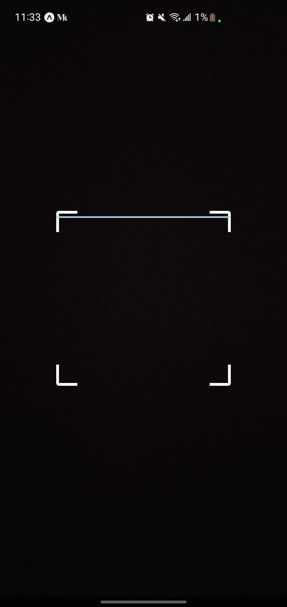

# QR Code Scanner Interface 🚀

Vous pouvez intégrer QR Code scanner dans vos projets.
Il utilise la camera de votre téléphone

Pour la gestion de l'autorisation, vous pouvez la personnaliser dans le fichier index.tsx
## Interface

;

